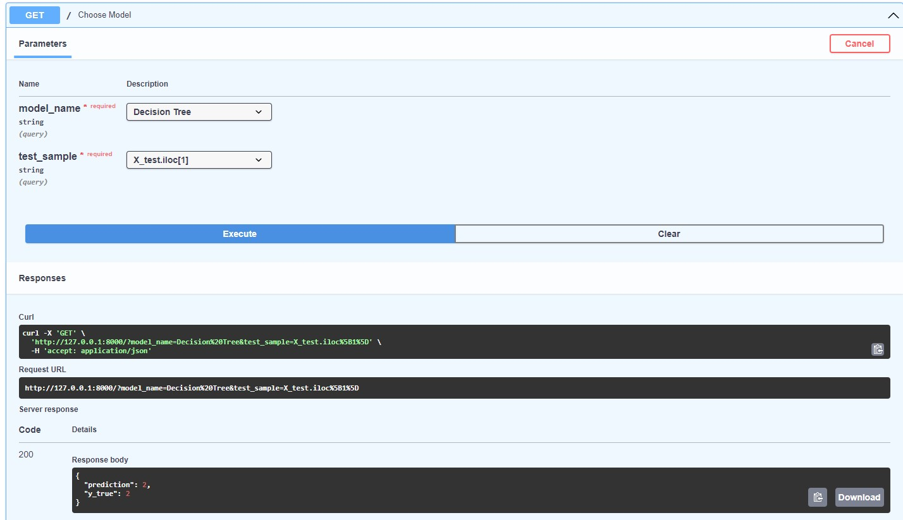

## This repo contains script with solution to internship tasks

## How to run:
1. Install requirements
2. Download dataset from [https://archive.ics.uci.edu/ml/datasets/Covertype](Link) and unzip in folder with script main.py
3. Run ``` uvicorn main:app``` (execution may take few minutes)
4. Open http://127.0.0.1:8000/docs - simple api where you can use models to predict covertype for two different samples from y_test
